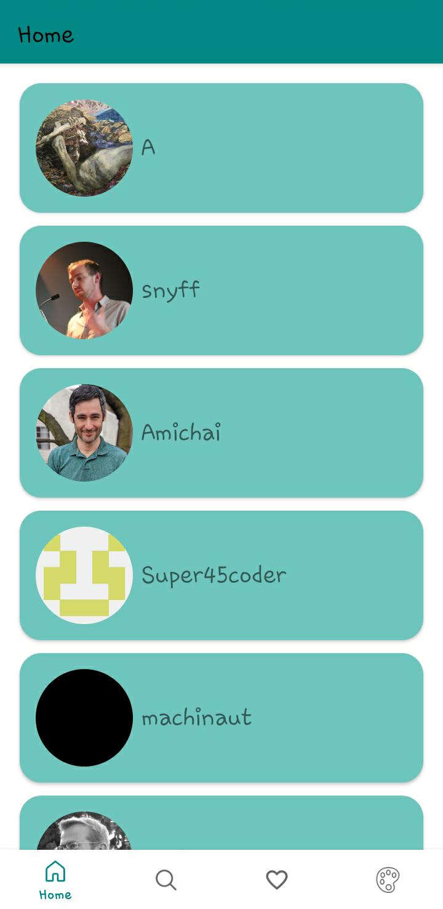
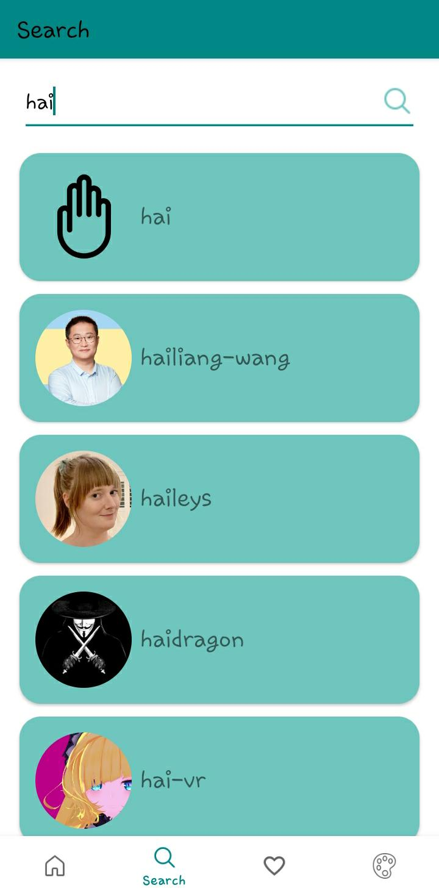
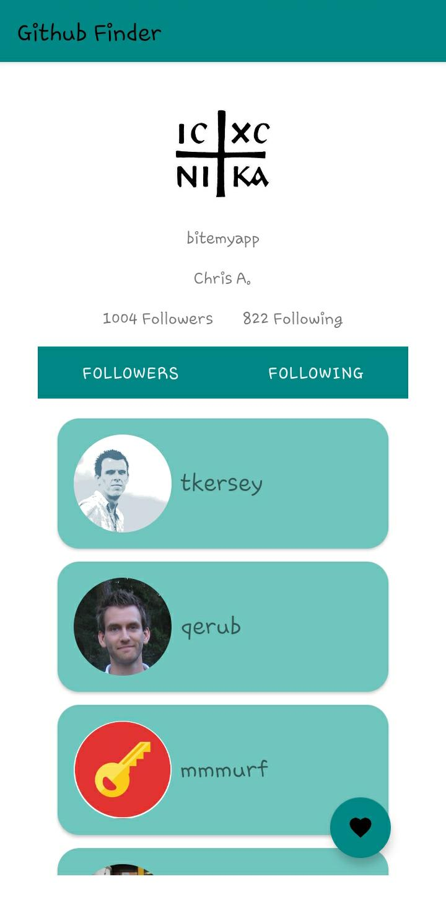
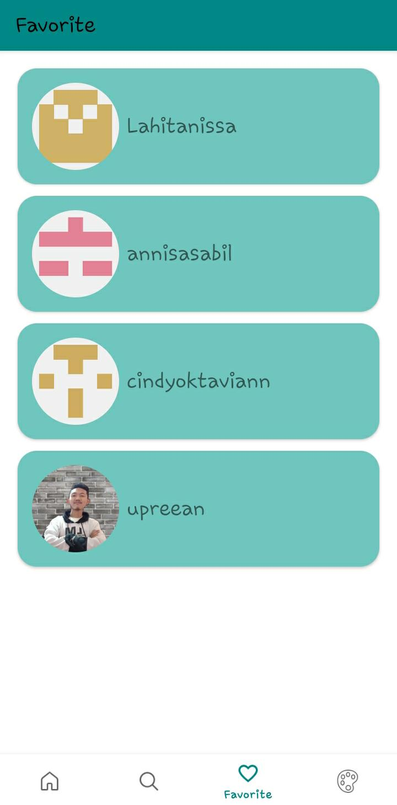
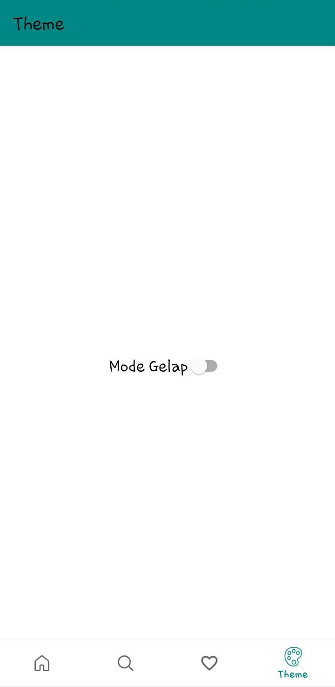

# Kelompok-6 Kelas-A Teknik Informatika-21

Pengembang aplikasi mobile Github Finder dari Kelompok-6 Kelas-A Teknik Informatika-21:
- Anissa Tri Lahitani -> 1217050015
- Annisa Sabillah -> 1217050016
- Aprian Nur Rohman -> 1217050018
- Cindy Oktavian -> 1217050028

# Pengantar

Github Finder adalah aplikasi mobile yang memudahkan Anda untuk mencari dan menemukan user di GitHub. Aplikasi ini memiliki fitur-fitur yang lengkap dan mudah digunakan, sehingga cocok untuk Anda yang ingin mencari user di GitHub, baik untuk keperluan pribadi maupun profesional.

- Aplikasi ini dapat diunduh pada tautan berikut: [https://play.google.com/store/apps/details?id=com.group.githubfinder&pcampaignid=web_share](https://play.google.com/store/apps/details?id=com.group.githubfinder&pcampaignid=web_share)
- Pitch Deck: [Pitch Deck](https://drive.google.com/drive/u/1/folders/1PzooccJfiXgk_E0ohUE6EqfFI2tX28r7)
- Youtube: [Demo](https://youtu.be/mwdCaC8QY8E)

## Home

## Search

## Detail
 

## Favorite

## Theme

# Fitur

## Menampilkan semua user
Fitur ini memungkinkan Anda untuk melihat daftar semua user di GitHub. Anda dapat melihat nama, username, followers, dan following setiap user.

## Cari user
Fitur ini memungkinkan Anda untuk mencari user berdasarkan nama, atau username. Anda dapat menggunakan kata kunci untuk mempersempit hasil pencarian.

## Favoritkan user
Fitur ini memungkinkan Anda untuk menyimpan user favorit Anda. Anda dapat dengan mudah menemukan user favorit Anda di kemudian hari.

## Melihat halaman favorit
Fitur ini memungkinkan Anda untuk melihat semua user yang Anda favoritkan. Anda dapat melihat informasi lengkap tentang setiap user di halaman ini.

## Mengubah tema menjadi gelap
Fitur ini memungkinkan Anda untuk mengubah tema aplikasi menjadi gelap. Tema gelap dapat mengurangi ketegangan mata saat menggunakan aplikasi di malam hari.

# Teknologi

- Retrofit 2: Github Finder menggunakan Retrofit 2 untuk komunikasi API yang efisien dan mudah, dengan Konverter GSON untuk serialisasi/deserialisasi JSON.
- Glide: Kustomisasi dan pemuatan gambar yang mulus, Github Finder menggunakan Glide, memastikan pengalaman pengguna yang lancar.
- Arsitektur MVVM: Github Finder mengikuti arsitektur MVVM (Model-View-ViewModel), yang mempromosikan pemisahan masalah dalam pengembangan UI. Arsitektur ini meningkatkan pemeliharaan dan pengujian.
- Room : GitHub Finder menggunakan Room untuk mengelola dan berinteraksi dengan database lokal di perangkat Android.
- DAO: GitHub Finder menggunakan Data Access Object (DAO) sebagai bagian dari arsitektur Room.

# Alat

- Android Studio IDE Giraffe 2022.3.1
- Android SDK API level 34 dengan Minimum SDK API level 21
- Android Gradle Plugin Version 8.1.1
- JDK Version 17.0.6

